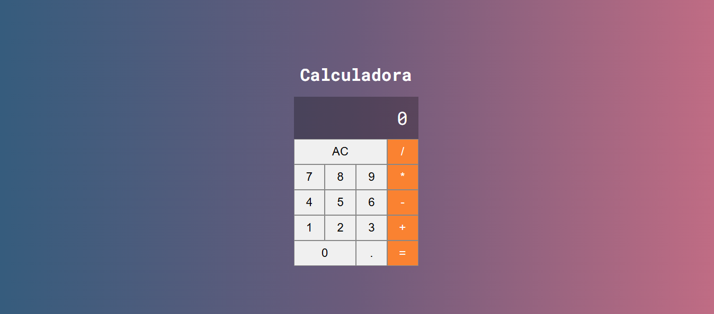
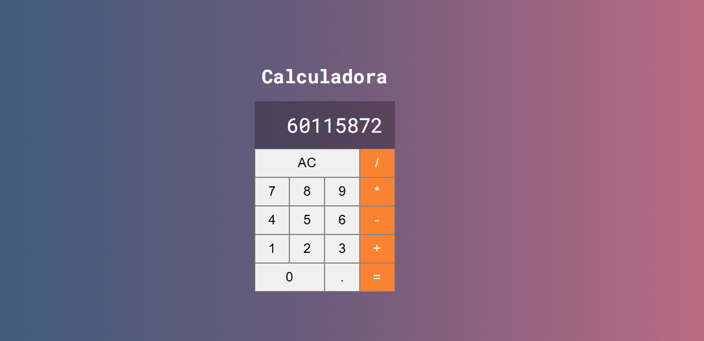

# 🧮 Calculadora

Este é um projeto de **Calculadora** desenvolvido com **ReactJS**, utilizando **JavaScript** e **CSS** puro para o estilo. A interface é simples e objetiva, com um layout limpo e responsivo. Ideal para praticar lógica com React e eventos de manipulação de estado.



# Guia de Estilo do Front-end

## 🎨 Layout

Os designs foram criados para as seguintes larguras:

- 📱 Mobile: `375px`
- 🖥️ Desktop: `1440px`

## 🌈 Cores

## 🎨 Paleta de Cores (Gradiente de Fundo)

### 🎯 Primárias

 - **Laranja** — #fa8231

### ⚪ Neutras

- **Azul escuro acinzentado** — #355c7d
- **bRoxo acinzentado** — #6c5b7
- **Rosa queimado** — #c06c84
- **Branco** — `hsl(0, 0%, 100%)`

## 🚀 Funcionalidades

- Adição (`+`)
- Subtração (`-`)
- Multiplicação (`*`)
- Divisão (`/`)
- Limpar (`AC`)
- Números decimais (`.`)
- Cálculo do resultado (`=`)

## 🛠️ Tecnologias Utilizadas

- [ReactJS](https://reactjs.org/)
- JavaScript (ES6+)
- CSS3

## 💡 Aprendizados

Durante o desenvolvimento deste projeto, foram praticados:

- Uso de `useState` para controle de estado da calculadora.
- Criação de componentes funcionais em React.
- Manipulação de eventos de clique em botões.
- Estilização com CSS puro.
- Lógica condicional e operações matemáticas em JavaScript.

## 🎯 Objetivo

Este projeto tem fins educativos e foi desenvolvido para praticar os conceitos fundamentais do React aliados à lógica básica de uma calculadora.

## 📸 Preview

Veja abaixo uma prévia da interface:



## ▶️ Como executar

1. Clone o repositório:
   ```bash
   git clone https://github.com/seu-usuario/calculadora-react.git

# 🚀 Primeiros Passos com Create React App

Este projeto foi inicializado com [Create React App](https://github.com/facebook/create-react-app).

## 📦 Scripts Disponíveis

No diretório do projeto, você pode executar os seguintes comandos:

---

### ▶️ `npm start`

Inicia a aplicação em **modo de desenvolvimento**.\
Abra [http://localhost:3000](http://localhost:3000) no navegador para visualizar.

- A página será recarregada automaticamente ao fazer alterações no código.
- Possíveis erros de lint também serão exibidos no console.

---

### ✅ `npm test`

Executa o **test runner** em modo interativo de observação.\
Veja mais na seção sobre [execução de testes](https://facebook.github.io/create-react-app/docs/running-tests).

---

### 🛠️ `npm run build`

Cria uma **versão otimizada para produção** na pasta `build`.

- O React será empacotado corretamente no modo de produção.
- O build será minificado e os arquivos conterão hashes nos nomes para melhor performance.
- Sua aplicação estará pronta para ser **implantada**.

Veja mais na seção sobre [deployment](https://facebook.github.io/create-react-app/docs/deployment).

---

### ⚠️ `npm run eject`

> **Atenção:** essa ação é irreversível! Uma vez que você usar `eject`, **não é possível voltar atrás!**

Caso não esteja satisfeito com as configurações do build, você pode executar o `eject`.\
Isso moverá todas as dependências e arquivos de configuração (Webpack, Babel, ESLint, etc.) para dentro do seu projeto.

- Todos os comandos continuarão funcionando, mas agora você terá **controle total** sobre cada configuração.
- Você não precisa usar o `eject` — os recursos fornecidos já são suficientes para a maioria dos projetos pequenos e médios.
